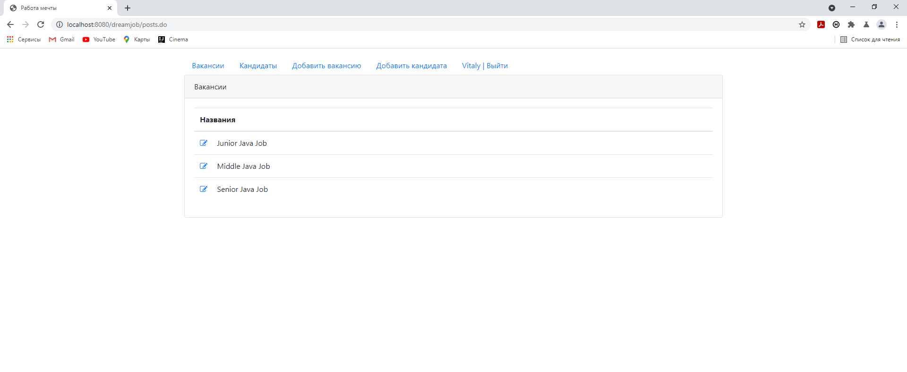
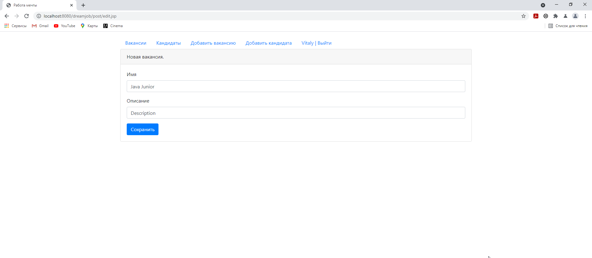

Биржа работы
=============

Биржа работы - это Web приложение, которое позволяет публиковать (редактировать) объявления, а так же размещать вакансии. Вся полученная информация сохраняется в базе данных (фотографии сохраняются в отдельной папке на сервере). В приложении присутствует регистрация и авторизация, в приложении настроена система фильтрации (без авторизации пользователям доступна только стартовая страница). 

#### Инструменты:
В данном проекте использовались следующие инструменты:    
1) IntelliJ Idea    
2) Maven    
4) Git    
5) Servlet 
6) JSP
7) Ajax   
6) PostgreSQL.      
### Стартовая страница

____

### Список кандидатов

____

### Добавления кандидата

____

### Добавление вакансии

### Регистрация

### Авторизация

